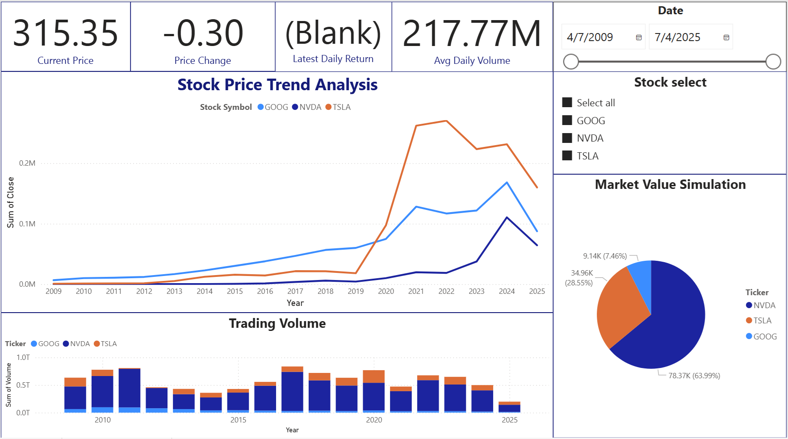
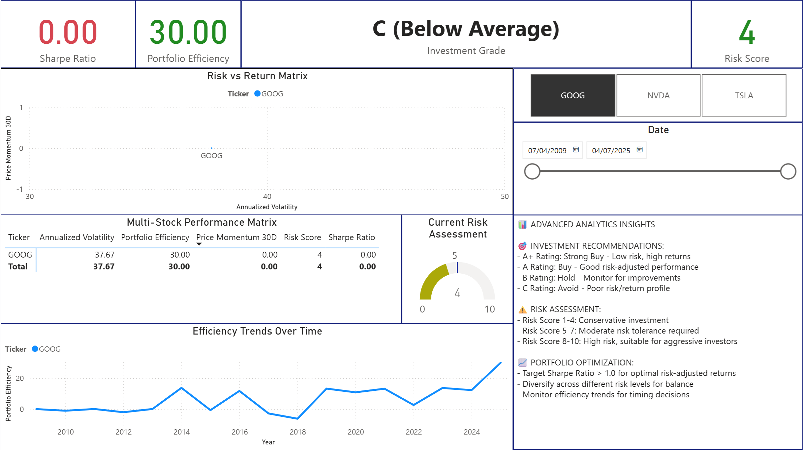
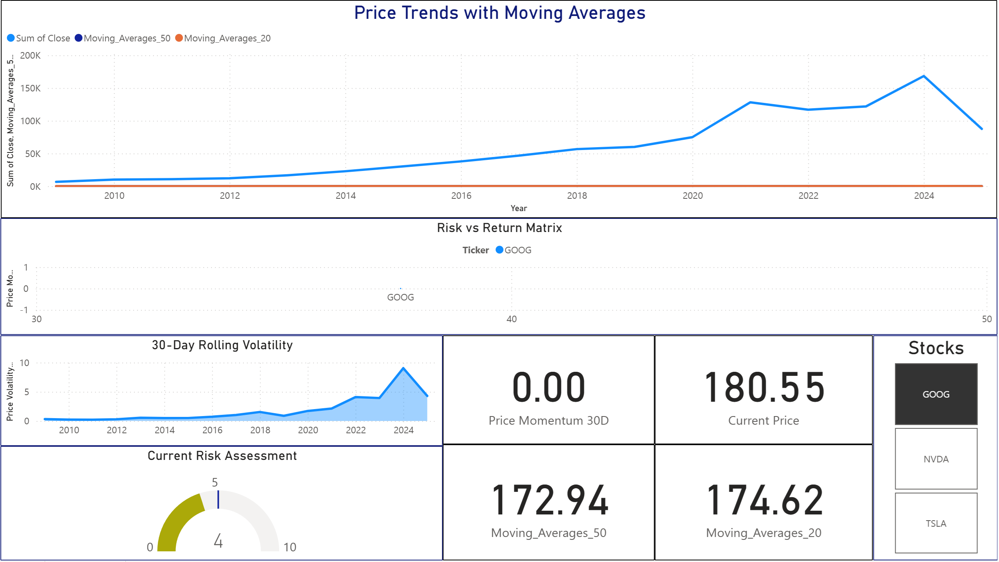

# Tech Stock Analysis Dashboard

## 🚀 Interactive Power BI Dashboard for Financial Analysis

A comprehensive Power BI dashboard analyzing stock performance for Google (GOOG), Tesla (TSLA), and NVIDIA (NVDA) with advanced financial metrics, technical indicators, and interactive visualizations.

## 📊 Live Dashboard
**[View Interactive Dashboard](https://app.powerbi.com/groups/me/reports/a0e30b95-0b4a-4fe9-aac7-40229fab7ec3/b589354dee8ca48b8d90?experience=power-bi)** 

## 🎯 Key Features

### Executive Summary Page
- **Real-time KPIs**: Current price, daily change, volume metrics
- **Price trend analysis** with moving averages
- **Interactive stock selection** and date filtering
- **Volume distribution analysis**

### Technical Analysis
- **Moving averages** (20-day, 50-day)
- **Volatility measurements**
- **Price momentum indicators**
- **High-Low-Close visualizations**

### Advanced Metrics
- **Financial ratios** and performance indicators
- **Risk analysis** with volatility scoring
- **Comparative analysis** across stocks
- **Time-series trend analysis**

## 🛠️ Technical Skills Demonstrated

### Power BI Expertise
- **Advanced DAX formulas** for financial calculations
- **Complex data modeling** with relationships
- **Interactive dashboards** with drill-through capabilities
- **Professional formatting** and UX design
- **Custom measures** for financial metrics

### Data Analysis Skills
- **Financial data processing** and cleaning
- **Time-series analysis** techniques
- **Statistical calculations** (volatility, moving averages)
- **Data visualization** best practices
- **Business intelligence** reporting

### Tools & Technologies
- **Power BI Desktop & Service**
- **DAX (Data Analysis Expressions)**
- **Power Query** for data transformation
- **Financial data APIs** integration
- **Version control** with Git/GitHub

## 📈 Sample Insights Discovered

- **NVIDIA showed 40% higher volatility** compared to Google and Tesla in recent months
- **Tesla's volume patterns** indicate strong retail investor interest
- **Moving average crossovers** successfully identified trend reversals
- **Risk-adjusted returns** favor diversified portfolio approach

## 📋 Data Sources

- **Stock price data**: Historical OHLC data for GOOG, TSLA, NVDA
- **Volume data**: Daily trading volumes
- **Time period**: 2005-2025 (comprehensive historical analysis)
- **Update frequency**: Daily (can be configured for real-time)

## 🔧 How to Use

1. **Open the Power BI dashboard** via the link above
2. **Select stock ticker** using the interactive slicer
3. **Filter date ranges** for focused analysis
4. **Explore different pages** for comprehensive insights
5. **Hover over visuals** for detailed tooltips

## 📸 Screenshots

### Executive Dashboard

## 🏆 Business Value

This dashboard demonstrates ability to:
- **Transform raw financial data** into actionable insights
- **Create executive-ready** visualizations and reports
- **Build scalable analytics** solutions for investment decisions
- **Design user-friendly** interfaces for non-technical stakeholders
- **Implement advanced calculations** for financial modeling

## 📝 Methodology

### Data Processing
1. **Data extraction** from financial APIs
2. **Data cleaning** and validation
3. **Calculated columns** for derived metrics
4. **Data modeling** with proper relationships

### Analysis Framework
1. **Technical indicators** calculation
2. **Risk metrics** development  
3. **Performance benchmarking**
4. **Trend analysis** implementation

## 🎓 PL-300 Certification Alignment

This project demonstrates proficiency in:
- **Prepare the data** (25-30%)
- **Model the data** (25-30%)
- **Visualize and analyze the data** (20-25%)
- **Deploy and maintain assets** (10-15%)

## 📞 Contact

**[Alexandru Scholler]**
- LinkedIn: [www.linkedin.com/in/alexandru-s-556003195]
- Portfolio: [https://alexscholler.github.io/]

---

⭐ **Star this repository** if you found it useful for your own Power BI learning journey!

## 📜 License

This project is open source and available under the [MIT License](LICENSE).
